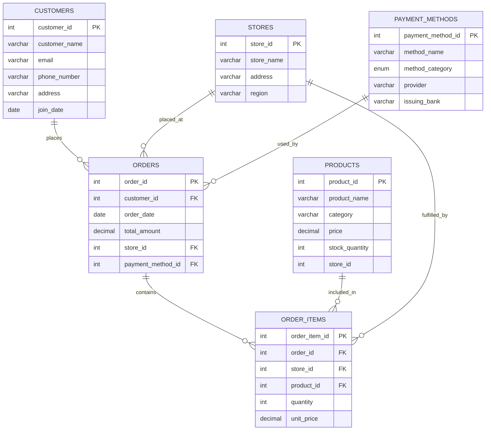

# Retail Analytics: Synthetic Sales and Orders Database

A normalized, synthetic SQL database project that simulates a retail business environment, including customers, orders, products, stores, and payment methods. Ideal for OLTP modeling, business queries, and analytics visualization with Tableau.

---
Dashboard Preview

---

## 📌 Project Overview

This project is designed to:
- Practice advanced SQL concepts including procedures, joins, and grouping.
- Support business use cases such as sales trends, payment distributions, and store performance.
- Serve as a backend for dashboards and data analytics exercises.

---

## 🧱 Database Tables

- **Customers** – User profile data including contact and address.
- **Orders** – Order metadata linking customers, stores, and payment methods.
- **Order Items** – Item-level breakdown of each order.
- **Products** – Product details with categories and prices.
- **Stores** – Store metadata with inferred region.
- **Payment Methods** – Payment types, banks, and provider details.

---

## 🔗 Relationships & Keys

- One customer can place many orders.
- Each order can have multiple order items.
- Products and stores are related via foreign keys in order items.
- Orders use a payment method.
- Each store stocks multiple products and fulfills orders.

---

## 📦 Entity Relationship Diagram

⚙️ Sample Stored Procedures
	•	TotalAvgSales() – Calculates total and average sales from order_items.
	•	SalesByStoreName(start_date, end_date) – Aggregates sales by store and category in a given date range.
	•	get_payment_distribution_top_region() – Shows top payment methods used by region.

⸻

📈 Use Cases
	•	Business Intelligence Dashboards
	•	OLAP Integration
	•	SQL Practice (Joins, Grouping, Aggregation, Procedures)
	•	Data Cleaning (Address → Region extraction)

⸻

🛠️ Technologies
	•	MySQL 8+
	•       Workbench
	•	Mermaid.js for ERD
	•	Tableau
